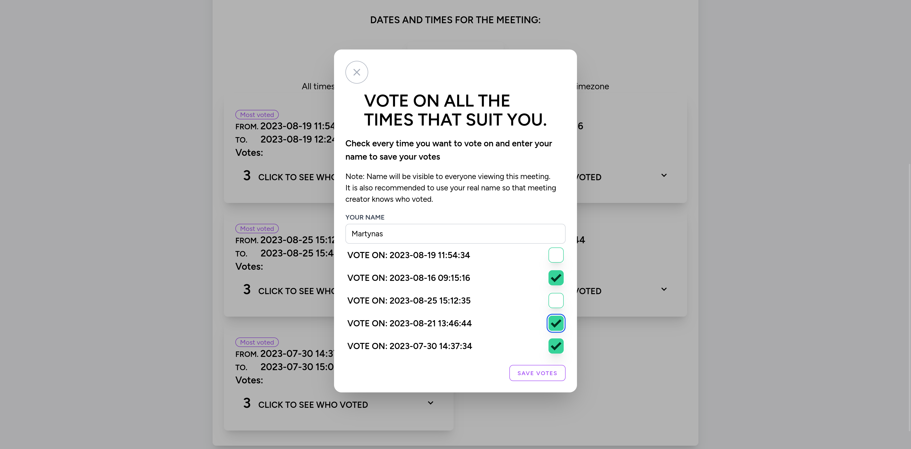
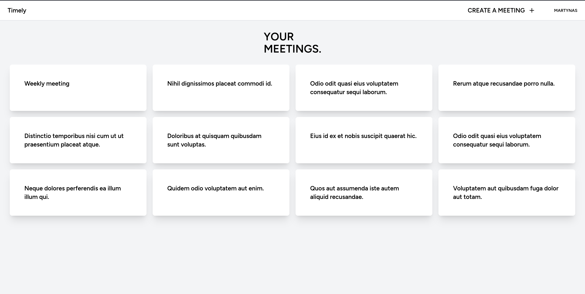
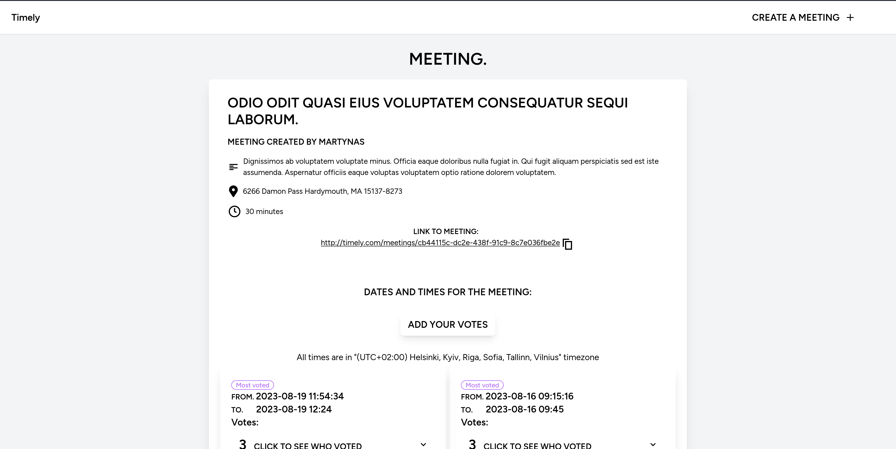
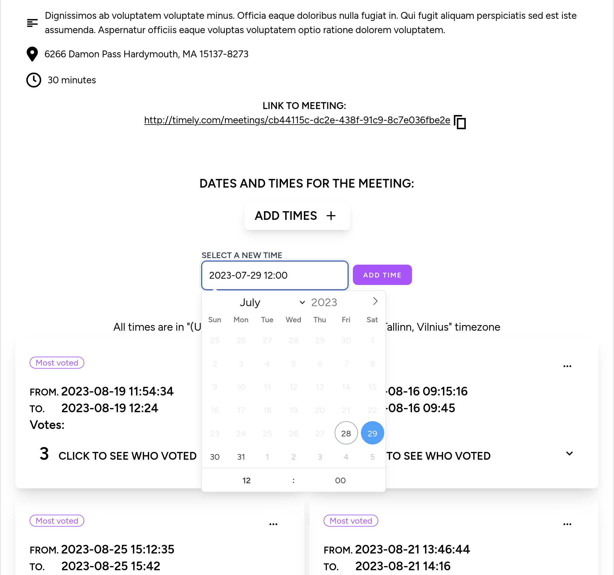

# Timely - Meeting Scheduling Made Easy

Timely is a user-friendly meeting scheduling web app designed to simplify the process of finding the perfect meeting time for everyone involved. Whether it's group meetings or one-on-one discussions, Timely streamlines the scheduling process with its intuitive interface and powerful features.

Try it [here](https://timely.lt)

## Features

- Free, open-source, and privacy-respecting
- Simple meeting page for effortless scheduling
- Intuitive date and time selection
- Support for both group and one-on-one meetings

## Screenshots

Voting page:



Dashboard:



Meeting page:



Adding times:




## License

[ GNU GPLv3 ](LICENSE)

    Timely, a meeting scheduling and time managing web app
    Copyright (C) 2023 Kibernetiku klubas

    This program is free software: you can redistribute it and/or modify
    it under the terms of the GNU General Public License as published by
    the Free Software Foundation, version 3 of the License

    This program is distributed in the hope that it will be useful,
    but WITHOUT ANY WARRANTY; without even the implied warranty of
    MERCHANTABILITY or FITNESS FOR A PARTICULAR PURPOSE.  See the
    GNU General Public License for more details.

    You should have received a copy of the GNU General Public License
    along with this program.  If not, see <https://www.gnu.org/licenses/>.


## Authors

- [Marsietis](https://github.com/Marsietis)
- [nitrogency](https://github.com/nitrogency)
- [archlich03](https://github.com/archlich03)

## Collaborators

- [Laury8nas](https://github.com/Laury8nas) Discovered and Reported Security Issues

## Documentation

For detailed usage instructions and other resources, refer to the [Documentation](docs/).

## Contributing

Contributions are always welcome!

See [Contributing](CONTRIBUTING.md) for ways to get started.

Please adhere to this project's [Code of conduct](CODE_OF_CONDUCT.md) while contributing.


## Run Locally

To run Timely locally, follow these steps:

Make sure that your system has [PHP](https://www.php.net/manual/en/install.php), [Composer](https://getcomposer.org/) and [node with npm](https://nodejs.org/en).

- Clone the repository
  ```
  git clone https://github.com/kibernetiku-klubas/timely.git
  ```
- cd to project dir
  ```
  cd first-project
  ```
- Install Composer Dependencies
  ```
  composer install
  ```
- Install NPM Dependencies
  ```
  npm install
  ```
- Create a copy of your .env file. More on .env files [here](env.md)
  ```
  cp .env.example .env
  ```
- Generate an app encryption key
  ```
  php artisan key:generate
  ```
- cd to database folder
  ```
  cd database
  ```
- Crete a sqlite database
  ```
  touch database.sqlite
  ```
- cd back
  ```
  cd ..
  ```
- Migrate the database
  ```
  php artisan migrate
  ```
- Run npm
  ```
  npm run dev
  ```
- Start project
  ```
  php artisan serve
  ```
- Go to ip shown in terminal
- Start building

## Security

For information about supported versions and vulnerability reporting,
please refer to our [Security Policy](SECURITY.md).

## Feedback

We value your feedback! If you have any suggestions or concerns, please reach out to us at feedback@timely.lt.

## Support

If you require assistance, don't hesitate to contact support@timely.lt.
