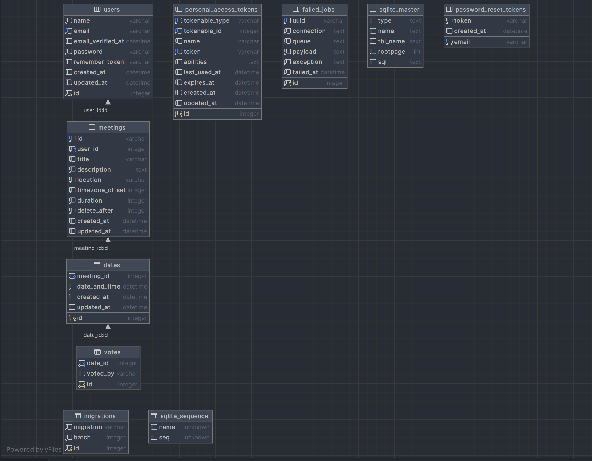

# Database Schema Documentation

This document provides an overview of the database schema used in our project. The schema depicts the structure of our database, including tables, relationships, and key attributes. Understanding the database schema is essential for effective development and data management.

## Table of Contents
- [Database Structure](#database-structure)
- [Database Diagram](#database-diagram)

# Database Structure

Our database consists of the following tables:

### Table: users

Used for storing user information.

#### Columns

| Column           | Type       | Description                                     |
|------------------|------------|-------------------------------------------------|
| `id`             | `bigint`   | Primary key for the table.                      |
| `name`           | `string`   | User's username for logging in. Must be unique. |
| `password`       | `string`   | User's password for logging in.                 |
| `remember_token` | `string`   | Token for session management.                   |
| `timestamps`     | `datetime` | Time of user creation and last update.          |

### Table: failed_jobs

Stores information about failed job execution attempts in our application.

#### Columns

| Column       | Type       | Description                                                                 |
|--------------|------------|-----------------------------------------------------------------------------|
| `id`         | `bigint`   | Primary key for the table.                                                  |
| `uuid`       | `string`   | Universally unique identifier for the failed job.                           |
| `connection` | `text`     | Name of the connection used to execute the job.                             |
| `queue`      | `text`     | Name of the queue used to execute the job.                                  |
| `payload`    | `longtext` | The serialized representation of the job payload.                           |
| `exception`  | `longtext` | The serialized representation of the exception that caused the job to fail. |
| `failed_at`  | `datetime` | Time of job failure.                                                        |

### Table: meetings_table

Used for storing information about a user-created meeting.

#### Columns

| Column         | Type       | Description                                                  |
|----------------|------------|--------------------------------------------------------------|
| `id`           | `uuid`     | Primary key for the table. Main ID is UUID.                  |
| `user_id`      | `bigint`   | Foreign key referencing the user who created the meeting.    |
| `title`        | `string`   | Title of the meeting.                                        |
| `description`  | `longtext` | Description of the meeting.                                  |
| `location`     | `string`   | Location of the meeting.                                     |
| `timezone`     | `string`   | Timezones of the meeting.                                    |
| `duration`     | `smallint` | Duration of the meeting (minutes).                           |
| `delete_after` | `integer`  | Time after which the meeting will be deleted.                |
| `is1v1`        | `tinyint`  | Boolean value indicating if the meeting is a 1-on-1 meeting. |
| `timestamps`   | `datetime` | Time of meeting creation and last update.                    |

### Table: dates

Stores date and time options for meetings.

#### Columns

| Column          | Type       | Description                                                            |
|-----------------|------------|------------------------------------------------------------------------|
| `id`            | `bigint`   | Primary key for the table.                                             |
| `meeting_id`    | `uuid`     | Foreign key referencing the associated meeting.                        |
| `date_and_time` | `datetime` | Date and time option for the meeting.                                  |
| `timestamps`    | `datetime` | Time of date option creation and last update.                          |
| `selected`      | `tinyint`  | Boolean value indicating if the date option is selected. Default is 0. |

### Table: votes

Stores votes for date options.

#### Columns

| Column     | Type     | Description                                              |
|------------|----------|----------------------------------------------------------|
| `id`       | `bigint` | Primary key for the table.                               |
| `date_id`  | `bigint` | Foreign key referencing the associated date option.      |
| `voted_by` | `string` | User identifier who voted for the date option. Nullable. |

## Database Diagram

Below is a visual representation of our database schema:

Understanding the database schema is crucial for maintaining a robust and scalable application. If you have any questions or need further clarification about the database structure, don't hesitate to reach out to the team.

Thank you for your commitment to maintaining a well-documented and organized database schema.
