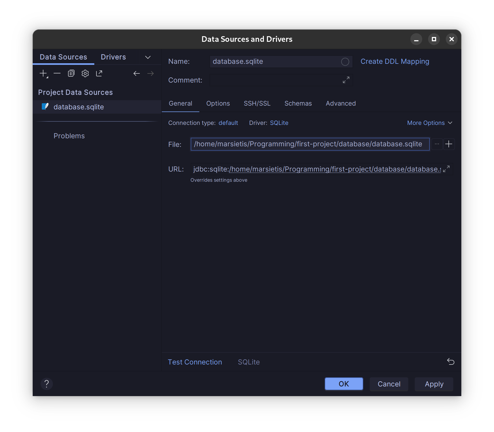

# Database

For this project we will be using sqlite database for development (project is currently configured for it) and in production we will switch to mysql.

To create a local sqlite database, in database directory use command
  ```
  touch database.sqlite
  ```
And run the migrations
  ```
  php artisan migrate
  ```
That's it. Your local database is set up.

To work with databases jetbrains have a database tool.

- Select the database tool


- Select new > datasource
- Select sqlite
- In the file path link to project's database

- Test connection and hit apply
- You can now edit the database tables and everything else straight form your IDE

