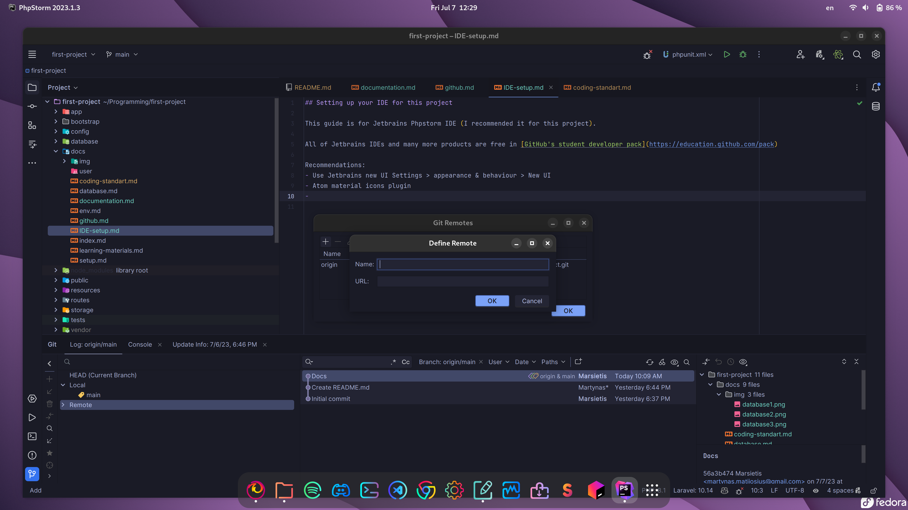

## Setting up your IDE for this project

This guide is for Jetbrains Phpstorm IDE (I recommended it for this project. Although if you really don't want to use it second-best option is VS code).

All of Jetbrains IDEs and many more products are free in [GitHub's student developer pack](https://education.github.com/pack)

### Highly recommended plugins
- [Laravel Idea](https://plugins.jetbrains.com/plugin/13441-laravel-idea) (Note: plugin is payed, but free with student licence)
- [.env files support](https://plugins.jetbrains.com/plugin/9525--env-files-support)

### Recommendations:
- Use Jetbrains new UI Settings > appearance & behaviour > New UI
- Atom material icons plugin
- Rainbow brackets plugin
- You can set up settings sync to sync your settings across all Jetbrains IDEs

### Of course the most important thing ever. Themes:
- One dark
- Tokyo night
- Monokai
- GitHub theme

### Setting up remote repo in Phpstorm:
- Follow these steps to push commits to GitHub repository straight from your IDE
- Select git tool in Phpstorm, select remote branch and right click and select manage remotes

- Add this project's repository

Shortcuts:
- Ctrl+k to commit
- Ctrl+Shift+k to push
- Ctrl+alt+n for a new branch
